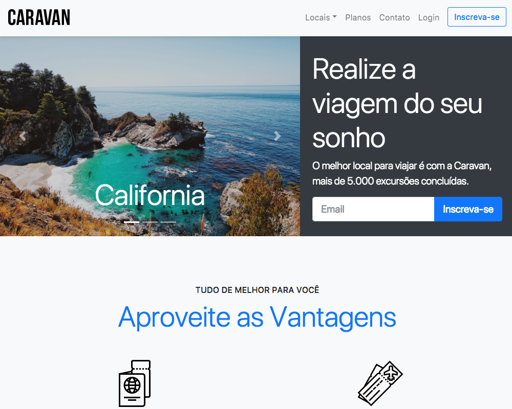

# <p align="center">

Caravan é um site de viagens desenvolvido com Bootstrap 4,
como projeto do curso da [Origamid]("https://www.origamid.com/curso/bootstrap-4")

<h1 align="center">
   
</h1>

<h4 align="center"> 
	 Caravan ♻️ Concluído
</h4>

</p>

## 🚀 Sobre mim

Eu sou um QA/Tester que está se aventurando para ser um  dev front-end.

## Aprendizados

Como utilizar e manipular as várias maneiras de se usar o Bootstrap e como otimiza muito o trabalho para uma entrega mais dinâmica e ágil.

## Stack utilizada

- ```Bootstrap 4```
- ```Javascript```

## Autor

[@santosvini](https://github.com/santosvini)


